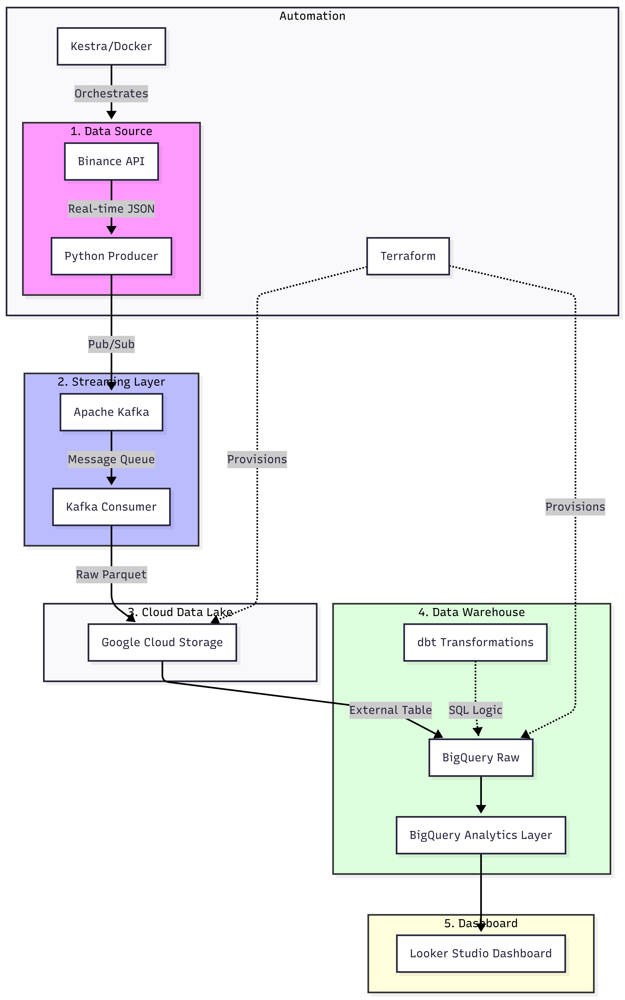
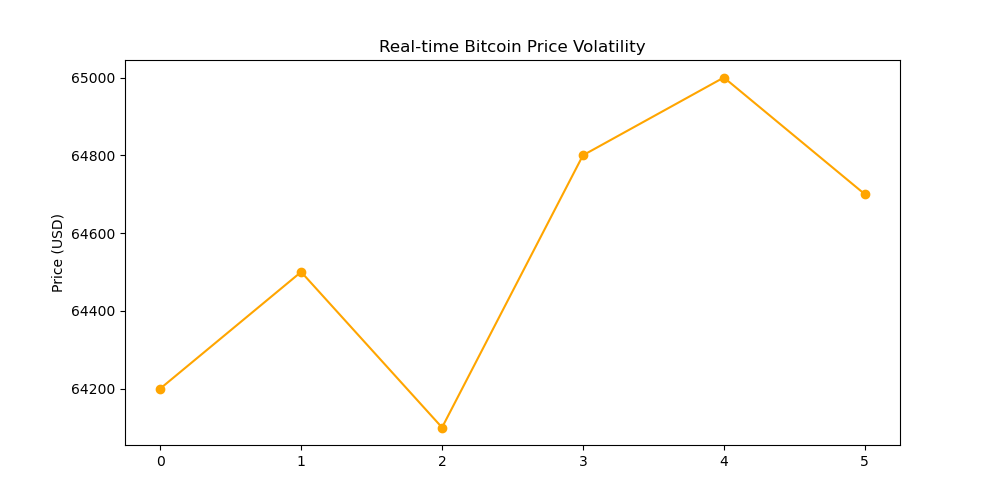
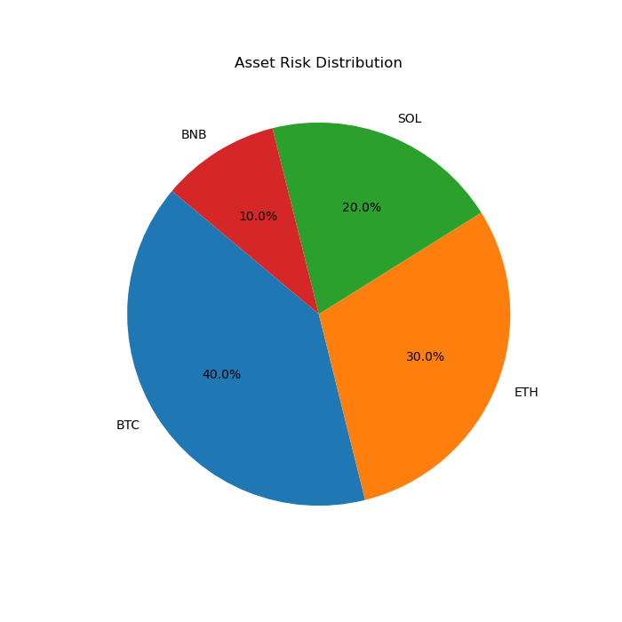

🚀 Nexus-Crypto: High-Frequency Data Engineering Pipeline

📖 1. Project Overview

In the high-stakes world of Cryptocurrency, price volatility can liquidate portfolios in seconds. Standard batch processing is insufficient for real-time risk management.

Nexus-Crypto is a production-grade data pipeline designed to ingest, process, and analyze live market data with sub-second latency. This project demonstrates the transition from local development to a fully automated cloud architecture using Industry-standard tools.

🏗️ 2. System Architecture

The pipeline follows the Medallion (Bronze/Silver/Gold) Architecture:

Data Flow:

Ingestion: Python producers fetch live tickers via WebSockets/REST APIs.

Streaming: Apache Kafka manages high-velocity message queues.

Storage (Data Lake): Raw Parquet files are stored in Google Cloud Storage (GCS).

Warehouse: Google BigQuery acts as the analytical engine.

Transformation: dbt performs SQL modeling, partitioning, and clustering.

Orchestration: Kestra automates the entire workflow DAG.

🛠 3. Tech Stack & Tools

| Category | Technology |
| :--- | :--- |
| **Infrastructure as Code** | Terraform (GCP Provisioning) |
| **Orchestration** | Kestra |
| **Stream Processing** | "Apache Kafka (Zookeeper, Producer, Consumer)" |
| **Data Lake** | Google Cloud Storage |
| **Data Warehouse** | Google BigQuery |
| **Transformation** | dbt Core |
| **Backend API** | FastAPI |
| **Visualization** | Google Looker Studio / Streamlit |

📊 4. Key Professional Features

A. Optimization (Partitioning & Clustering)

To minimize costs and maximize query speed in BigQuery, I implemented:

Time-Unit Partitioning: Tables are partitioned by event_timestamp (Daily). This reduces data scanned by up to 90% for daily reports.

Clustering: Data is clustered by coin_symbol, ensuring rapid filtering for specific assets like BTC or ETH.

B. Infrastructure as Code (IaC)

Zero manual resource creation. The entire GCP environment (Buckets, Datasets, Roles) is managed via Terraform scripts to ensure 100% reproducibility.

C. Data Quality & Testing

Using dbt tests, I implemented schema validation:

not_null: Ensures critical price data is never missing.

unique: Prevents duplicate trade entries in the final Gold tables.

📈 5. Visual Insights (Dashboard)

The dashboard provides real-time monitoring of market risk.

Live Price Volatility

Asset Distribution & Risk Analysis

🚀 6. How to Run This Project

Prerequisites
Docker & Docker Compose

Google Cloud Platform (GCP) Account

Terraform installed

Step 1: Provision Infrastructure

Bash
cd terraform
terraform init
terraform apply -auto-approve

Step 2: Launch Services

Bash
docker-compose up -d

Step 3: Run the Pipeline
Access the Kestra UI at http://localhost:8080 and trigger the nexus_crypto_main flow.

📂 7. Project Structure

nexus-crypto/
├── api/              # FastAPI Serving Layer
├── dbt_models/       # SQL Transformations & Tests
├── docs/             # Screenshots & Architecture Diagrams
├── flows/            # Kestra Workflow YAMLs
├── kafka/            # Producers & Consumers
├── src/              # Utility Scripts
├── terraform/        # IaC (main.tf, variables.tf)
├── docker-compose.yml
└── requirements.txt

🎓 8. Conclusion & Future Work

WorkThis project successfully demonstrates a scalable Data Engineering lifecycle. Future iterations will include Spark Streaming for complex event processing and MLOps integration for automated price prediction.

